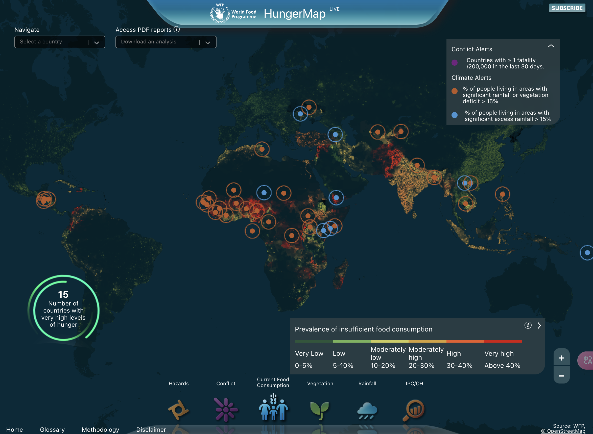


下载PDF简历


## 工作经历
<table>
    <thead>
        <tr>
            <th>企业</th>
            <th>企业名称</th>
            <th>职位</th>
            <th>日期</th>
        </tr>
    </thead>
    <tbody>
        <tr>
            <td style="vertical-align: middle;">
                
            </td>
            <td style="vertical-align: middle;">
                <a target="_blank" href="http://www.ytbig.com">
                    移通科技（杭州）有限公司
                </a>
                <!-- 
                Last Job
                 -->
            </td>
            <td style="vertical-align: middle;">
                数据架构师
                  
                

                数据产品经理
            </td>
            <td style="vertical-align: middle;">
                2022-2024
            </td>
        </tr>
        <tr>
            <td style="vertical-align: middle;">
                
            </td>
            <td style="vertical-align: middle;">
                <a target="_blank" href="https://www.iwhalecloud.com/">
                    浩鲸云计算科技股份有限公司
                </a>
            </td>
            <td style="vertical-align: middle;">
                数据开发
                  
                

                海外数据交付
            </td>
            <td style="vertical-align: middle; width: 80px">
               2021-2022
            </td>
        </tr>
        <tr>
            <td style="vertical-align: middle;">
                
            </td>
            <td style="vertical-align: middle;">
                <a target="_blank" href="https://www.isoftstone.com">
                    软通动力信息技术（集团）股份有限公司
                </a>
            </td>
            <td style="vertical-align: middle;">
                数据开发
            </td>
            <td style="vertical-align: middle;">
                2019-2020
            </td>
        </tr>
    </tbody>
</table>

---

## 项目经验

<table>
    <thead>
        <tr>
            <th>项目</th>
            <th>项目名称</th>
            <th>项目描述</th>
            <th>日期</th>
            <!-- <th>Company</th> -->
        </tr>
    </thead>
    <tbody>
        <tr>
            <td style="vertical-align: middle;">
                
            </td>
            <td style="vertical-align: middle; width: 100px;">
                <a target="_blank" href="https://hungermap.wfp.org/">共富大脑</a> 
                
                Active
                
            </td>
            <td style="vertical-align: middle;">针对政务系统数据数字改革，进行共富大脑数据底座的搭建及数据驾驶的开发.</td>
            <td style="vertical-align: middle; width: 80px; bold;">
                2022-2023
            </td>
        </tr>
    <tbody>
        <tr>
            <td style="vertical-align: middle;">
                
            </td>
            <td style="vertical-align: middle; width: 100px;">
                <a target="_blank" href="https://hungermap.wfp.org/">饥饿地图</a> 
                
                活跃
                
            </td>
            <td style="vertical-align: middle;">通过对90多个国家的粮食安全状况进行近实时监测, 通过数据模型和算法模型的预测分析, 为更好的决策提供依据.</td>
            <td style="vertical-align: middle; width: 80px; bold;">
                2020-2021
            </td>
        </tr>
        <tr>
            <td style="vertical-align: middle;">
                
            </td>
            <td style="vertical-align: middle;">
                <a target="_blank" href="https://www.sears.com.mx/">Carso Sears</a> 
                
                活跃
                
            </td>
            <td style="vertical-align: middle;">负责美西Carso数据中台的建设, 数据模型（维度建模）和数据指标的设计开发, 数据治理的治理和数据可视化的实现</td>
            <td style="vertical-align: middle;">
               2021-2022
            </td>
        </tr>
        <tr>
            <td style="vertical-align: middle;">
                
            </td>
            <td style="vertical-align: middle;">
                <a target="_blank" href="https://github.com/xuf-95/react-portfolio">react-portfolio</a>
                
                活跃
                
            </td>
            <td style="vertical-align: middle;">个人在线简历</td>
            <td style="vertical-align: middle; width: 90px;">
                2023-2024
            </td>
        </tr>
    </tbody>
</table>

---

## 教育经历

<table>
    <thead>
        <tr>
            <th>学校名称</th>
            <th>链接</th>
            <th>专业</th>
            <th>日期</th>
        </tr>
    </thead>
    <tbody>
        <tr>
            <td style="vertical-align: middle;">
                
            </td>
            <td style="vertical-align: middle;">
                <a target="_blank" href="https://github.com/xuf-95/react-portfolio">
                    中国人民大学 

                </a>   
                
                （网络教育）
                
            </td>
            <td style="vertical-align: middle;">
                人力资源与管理
            </td>
            <td style="vertical-align: middle;">
                2019-2022
            </td>
        </tr>
        <tr>
            <td style="vertical-align: middle;">
                
            </td>
            <td style="vertical-align: middle;">
                    <a target="_blank" href="https://www.hbcit.edu.cn/">河北工业职业技术学院
                </a> 
            </td>
            <td style="vertical-align: middle;">
                电气自动化
            </td>
            <td style="vertical-align: middle;">
                2015-2018
            </td>
        </tr>
    </tbody>
</table>

